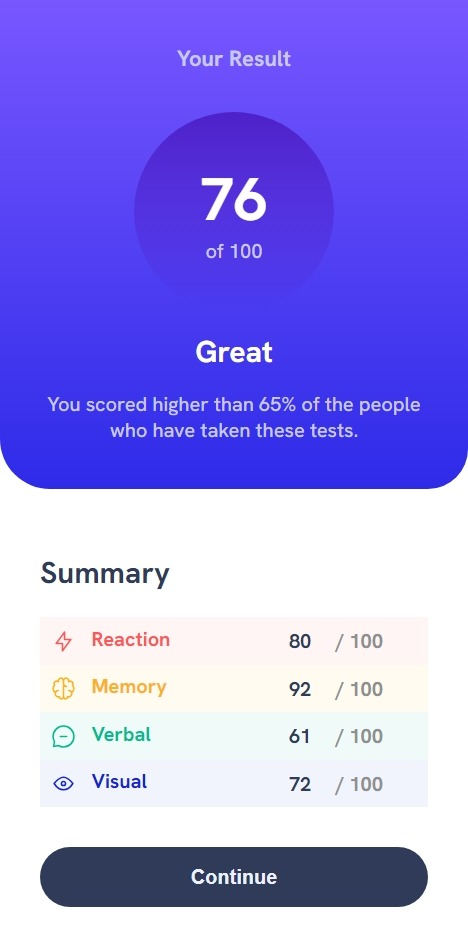
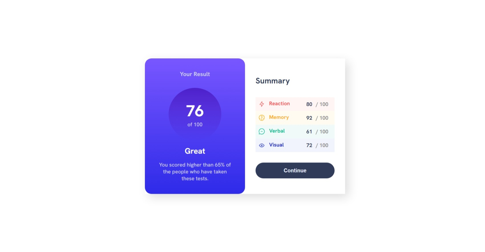

# Frontend Mentor - Results summary component solution

This is a solution to the [Results summary component challenge on Frontend Mentor](https://www.frontendmentor.io/challenges/results-summary-component-CE_K6s0maV). Frontend Mentor challenges help you improve your coding skills by building realistic projects. 

### The challenge

Users should be able to:

- View the optimal layout for the interface depending on their device's screen size
- See hover and focus states for all interactive elements on the page
- **Bonus**: Use the local JSON data to dynamically populate the content

### Screenshot

### Links

- Solution URL: [Add solution URL here](https://github.com/Darionvr/darionvr.github.io/tree/main/Results_Summary)
- Live Site URL: [Add live site URL here](https://darionvr.github.io/Results_Summary/)

## My process

For this challenge, I didn’t use the JSON file that was provided and instead used a full CSS table. I found this challenge very tricky due to details like the rounded corners on the blue card and the shadow on the entire summary, creating that layered effect

### Built with

- Semantic HTML5 markup
- CSS custom properties
- Flexbox
- CSS Grid

### What I learned

I learned how to make a circle div with some text inside of it, and it was the first time styling a table.It was a little difficult to put everything in order in my css file trying not to create an inifinite amount of code. 

### Continued development

I need to keep learning how to styling tables, I wasn't able to put a gap between each row and create the round corners. I tried using border-radius and gap but they had no effect on the table. 

## Author

- Frontend Mentor - [@yourusername](https://www.frontendmentor.io/profile/Darionvr)

