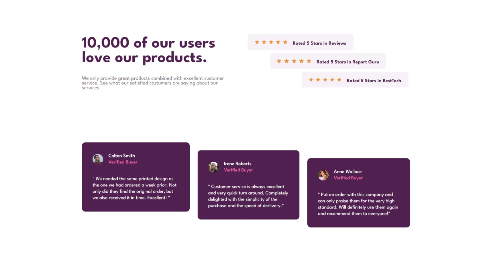

# Frontend Mentor - Social proof section solution

This is a solution to the [Social proof section challenge on Frontend Mentor](https://www.frontendmentor.io/challenges/social-proof-section-6e0qTv_bA). Frontend Mentor challenges help you improve your coding skills by building realistic projects. 

### Screenshot

### Links

- Solution URL: [Github](https://github.com/Darionvr/darionvr.github.io/tree/main/Social-proof)
- Live Site URL: [Gitpages](https://darionvr.github.io/Social-proof/)

## My process

### Built with

- Semantic HTML5 markup
- CSS custom properties
- Flexbox
- CSS Grid
- Mobile-first workflow

### What I learned

What definitely gave me trouble was arranging the cards in a cascading order because they didn’t respect the block space and overlapped with other elements. To solve it, I added a margin only to the center card and kept all of them using the flex and align-self properties. 

## Author

- Instagram - [Nico](https://www.instagram.com/darionvr/)
- Frontend Mentor - [@darionvr](https://www.frontendmentor.io/profile/Darionvr)

