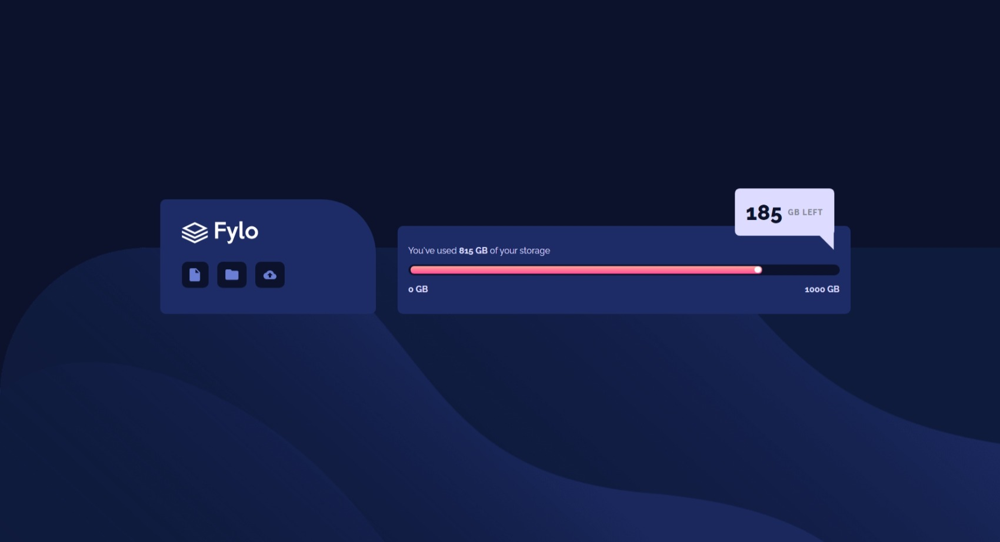
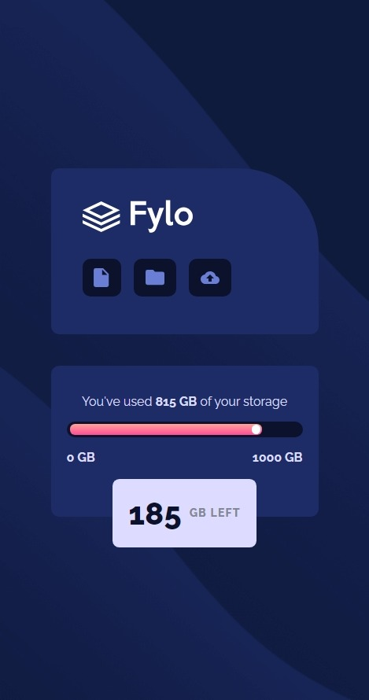

# Frontend Mentor - Fylo data storage component solution

This is a solution to the [Fylo data storage component challenge on Frontend Mentor](https://www.frontendmentor.io/challenges/fylo-data-storage-component-1dZPRbV5n). Frontend Mentor challenges help you improve your coding skills by building realistic projects. 

## Overview

### The challenge

Users should be able to:

- View the optimal layout for the site depending on their device's screen size

### Screenshot

### Links

- Solution URL: [Github](https://github.com/Darionvr/darionvr.github.io/tree/main/fylo-data-storage-component-master)
- Live Site URL: [Gitpage](https://darionvr.github.io/fylo-data-storage-component-master/)

## My process

### Built with

- Semantic HTML5 markup
- CSS custom properties
- Flexbox
- CSS Grid
- Mobile-first workflow

### What I learned

I learned to create shapes and work with empty boxes just by adding colors and sizes to them.

### Continued development

### Useful resources

- [Triangle shape video](https://www.youtube.com/watch?v=qbxZhLHYN44&ab_channel=CodingArtist) - This helped me making the triangle shape.

## Acknowledgments

I used grid columns to give a fixed and proportional size to the different boxes in desktop mode,  This way, the boxes fill the space to the size I need, avoiding the need to specify widths.

Also, for the triangle shape on the "185Gb left" box I use the ::after pseudo class. 
